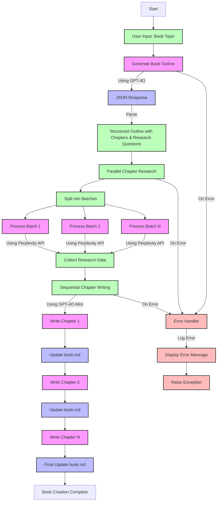

# Book Maker Process Flow

The above flow chart illustrates the complete process of the book maker application. Here's a breakdown of each major component:

1. **Initial Input**
   - User provides the book topic
   - System initializes with API keys and configurations

2. **Outline Generation**
   - GPT-4O generates a structured outline
   - Output includes chapters and research questions
   - Data is formatted in JSON for easy processing

3. **Parallel Research**
   - Chapters are processed in parallel batches
   - Each batch uses Perplexity API for research
   - Rate limiting and error handling are implemented

4. **Chapter Writing**
   - Sequential processing of chapters
   - GPT-4O-Mini writes each chapter
   - book.md is updated after each chapter completion

5. **Error Handling**
   - Comprehensive error catching at each stage
   - Colored console output for status updates
   - Graceful error recovery where possible

The process is designed to be efficient with parallel processing where possible, while maintaining data consistency and providing real-time updates to the user.